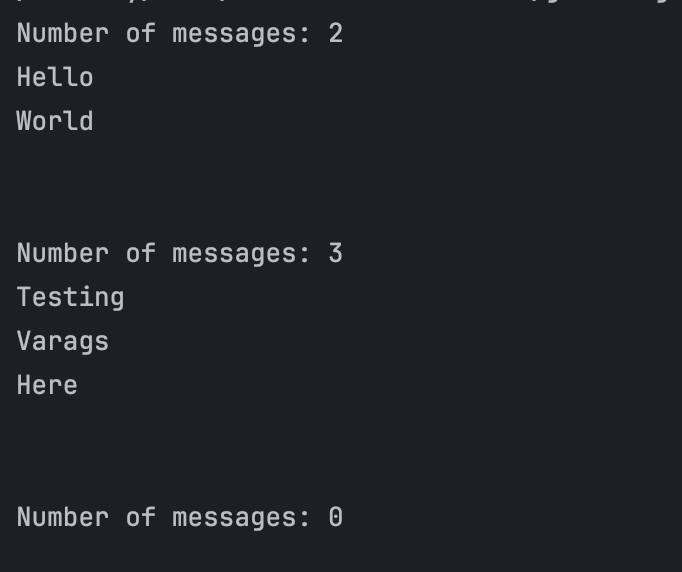
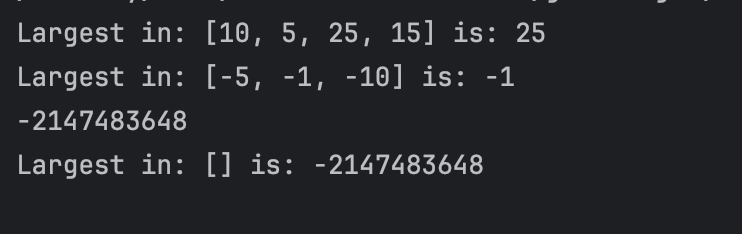
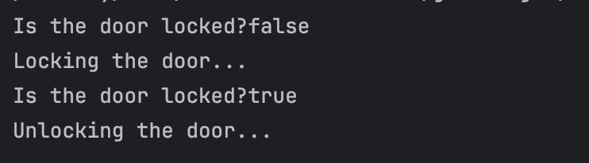
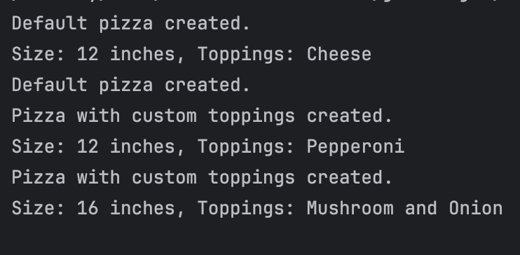
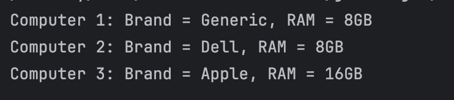
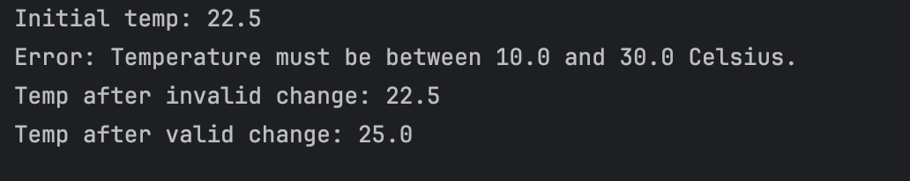
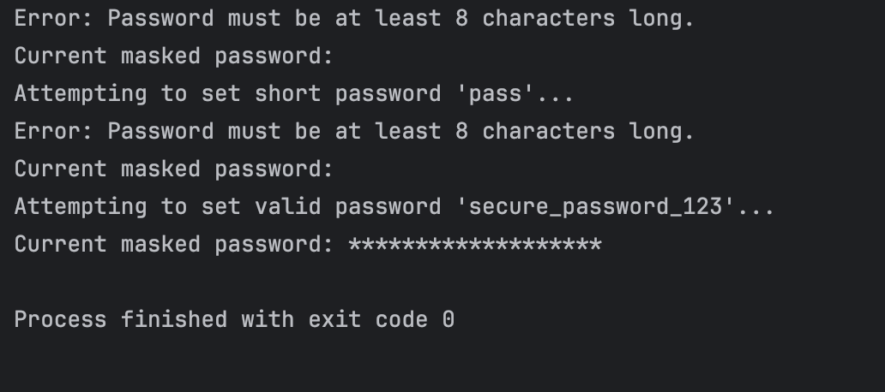

# Lab: Mastering Methods and Encapsulation
### by: Ivan Frondozo

## Description:

This is a simple Java program designed to explore creation of methods, metho overloading, and Encapsulation practices to get a deeper understanding of its nuances.

## Output:

### Exercise 1

### Mini challenge 1

### Exercise 2

### Mini challenge 2

### Exercise 3

### Mini challenge 3

### Exercise 4

### Mini challenge 4

### Exercise 5

### Mini challenge 5

### Exercise 6

### Mini challenge 6

### Exercise 7

### Mini challenge

### Exercise 8

### Mini challenge 8

